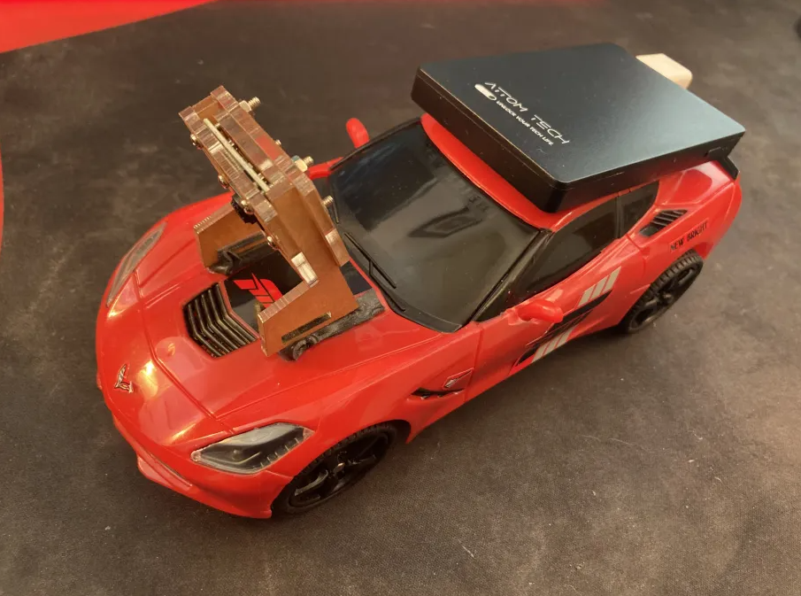

# About
>We have modified a toy rc-car so that it may be automatically driven through our python libraries over WIFI. The car features controllable motors for speed and direction, and also a Raspberry-PI Camera.

> 

# Documentation

### CarController(params)

> ### ip(required)
> The IP of the car's server to connect to.

> ### image_rate
> The interval at which to fetch the image from the camera of the car, set to -1 to fetch nothing at all.

> ### image_downsample
> The amount to scale down the image the car sends from the image fetch, higher is faster.

> ### control_rate
> The interval at which to send car inputs to the car's server.

> ### delay_check_rate
> The interval at which to check for latency between the client and server. Latency is stored in the CarManager.delayMS property.

> [!WARNING]
> For image_rate / control_rate / delay_rate, do not use too low of a value or the server will become flooded.

```python
CarManager = CarControl(ip="http://127.0.0.1:5000")
```
```python
CarManager = CarControl(ip="http://127.0.0.1:5000",
                        image_rate=0.1,
                        control_rate=0.1)
```
```python
CarManager = CarControl(ip="http://127.0.0.1:5000",
                        image_rate=0.1,
                        control_rate=0.1,
                        image_downsample=10)
```

### CarController.turn(params)

> ### value(required)
> The direction that the wheels should be set to. -1 is left, 1 is right, keep the value between -1 and 1.

```python
CarManager = CarControl(ip="127.0.0.1:5000")
CarManager.turn(-1) #turn left
```

### CarController.speed(params)
> ### value(required)
> The speed that the wheels should turn -1 is backwards, 1 is forwards, keep the value between -1 and 1 and low.

```python
CarManager = CarControl(ip="127.0.0.1:5000")
CarManager.speed(-0.3) #move backwards
```

### CarController.carImage
> A numpy RGB array containing the most recently fetched image from the car.

```python
CarManager = CarControl(ip="127.0.0.1:5000")
time.sleep(0.5)
print(CarManager.carImage)
```

### CarController.delayMS
> An integer representing the milliseconds of latency between the client and server

```python
CarManager = CarControl(ip="127.0.0.1:5000", delay_check_rate=0.5)
time.sleep(1)
print(CarManager.delayMS)
```

# Examples

```python
from car_module import CarControl;
import time;

if __name__ == "__main__":

    CarManager = CarControl('http://20.1.1.70:5000', image_rate=-1); #Create Car Controller
    #image_rate=-1 makes it so that the manager will not fetch camera image (faster)


    time.sleep(0.1);

    #Move slowly forward and left
    CarManager.speed(0.3); #NOTE: the car goes fast, so keep the value low
    CarManager.turn(-1);

    time.sleep(0.5); #Stay that way for half a second

    #Stop moving, and stop turning
    CarManager.speed(0);
    CarManager.turn(0);

    time.sleep(0.1); #Give thread time to send 0 speed/turn instruction...

    CarManager.terminate(); #End controller
```

```python
from car_module import CarControl;
import time;

import PIL;
from PIL import Image;

if __name__ == "__main__":

    CarManager = CarControl('http://20.1.1.70:5000', image_downscale=3); #Create Car Controller

    #image_downscale is how much to reduce the resolution of the image.
    #lower resolution image = faster

    time.sleep(0.1); #give time to fetch image

    imageArray = CarManager.carImage #RGB pixels
    PIL.Image.fromarray(imageArray, "RGB").show()

    CarManager.terminate(); #End controller

```
